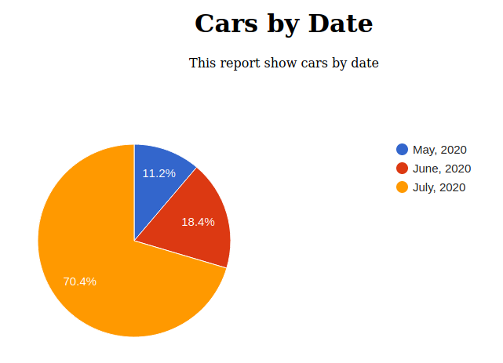
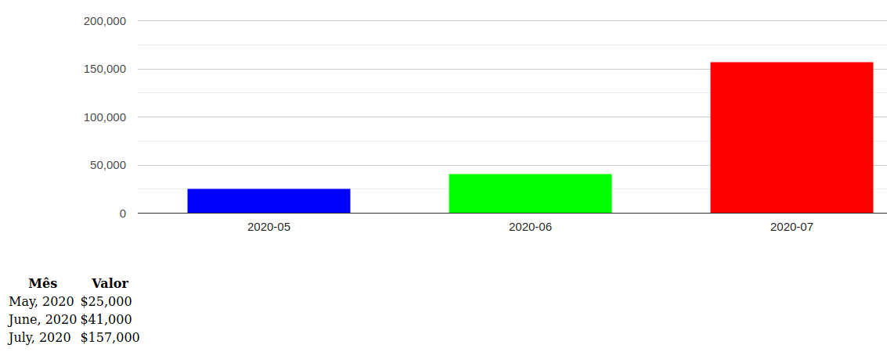

# Criando relatórios em PHP usando o Koolreport

## Requisitos

- PHP 5.6
- Composer

## Que tipo de relatório cria?

Funciona com Laravel, CakePHP e qualquer programa em PHP, como também com frameworks Java, Phyton, nodejs e programas criados com estas linguagens, desde que usem um SGBD suportado (veja abaixo) e tenham o PHP 5.4 ou superior instalado. O Koolreport se conecta diretamente ao banco para criar o relatório e é independente do programa.

Cria relatórios com diversos tipos de gráficos e customizável. Puxa os dados diretamente do banco de dados, que pode ser MySQL, Oracle, PostgreSQL, SQL Server, CSV, Excel, etc.

Basta ter o PHP 5.4 ou superior instalado e o banco de dados, que ele vai diretamente ao banco e cria os relatórios. Na prática não se integra a nenhum framework, mas ao banco de dados. Até existem pacotes no site oficial para integrar a alguns frameworks, mas acho assim mais flexível e menos trabalhoso. Não testei mas deve funcionar até com um banco remoto, basta indicar os dados na conexão.

## Quer Gerar Relatórios sem digitar código?

Criei um pequeno gerador de relatórios em que você não mexe em código, apenas entra os dados do banco e do relatório em um formulário e após clicar em enviar ele te mostra o relatório. Veja:

[Gerador de Relatórios](https://github.com/ribafs/report-generator)

## Confira exemplos e outros recursos no site oficial:

https://www.koolreport.com/

O Koolreport é uma ferramenta bem popular e com bom suporte da comunidade e da empresa que o criou. Quando temos uma dúvida e lançamos no Google é grande a quantidade de links que aparece.

## Capturas dos relatórios que criei






## Criando Relatórios com MySQL e PostgreSQL

Trouxe dois exemplos, usando gráficos de coluna e pizza, customizando cores das colunas e com suporte a MySQL e PostgreSQL (ao final). Um dos exemplos gera um gráfico de pizza e abaixo um de colunas, que é o CarsByDate.

No aprendizado criei alguns exemplos simples e bem customizados, gráficos de barra, colunas e pizza (mas existem outros tipos). Customizei as barras, colorindo cada uma com uma cor diferente. Confira abaixo. Também ofereço dois exemplos prontos, resultado do meu aprendizado, na pasta exemplos.

## Banco - cars
```sql
CREATE TABLE `colors` (
  `id` int NOT NULL AUTO_INCREMENT,
  `color` varchar(50) DEFAULT NULL,
  `date` date DEFAULT NULL,
  `value` int DEFAULT NULL,
  PRIMARY KEY (`id`)
);

INSERT INTO `colors` (`id`, `color`,`date`, `value`) VALUES
(1,	'preto','2005-05-25',	10000),
(2,	'preto','2005-05-28',	15000),
(3,	'preto','2005-06-15',	16000),
(4,	'branco','2005-06-15',	10000),
(5,	'branco','2005-06-15',	15000),
(6,	'branco','2005-06-16',	55000),
(7,	'vermelho','2005-07-18',	52000),
(8,	'vermelho','2005-07-18',	10000),
(9,	'vermelho','2005-07-21',	40000);
```

Precisar escolher bem os dois campos que representarão as colunas vertical e horizonta.

Aqui escolhi:

- color - horizontal
- value - vertical

Ele agrupará os registros pela cor e as mostrará na horizontal.

Também poderiamos escolher date e value, então ele agruparia pelo mês de cada data

mkdir /var/www/html/projeto

## Instalação da biblioteca

Acesse o diretório acima onde baixou e descompactou o projeto e execute

composer install

## Usando os exemplos

Agora que você instalou já pode usar um dos exemplos da pasta exemplos.

Basta copiar, por exemplo os 3 arquivos de exemplos/CarsByDate para a pasta

vendor/koolreport

Criar o banco cars e importar o script cars.sql da pasta exemplos

https://github.com/ribafs/reports/tree/main/exemplos

Então configurar o banco no arquivo CarsByDate.php na função settings()

Chame pelo navegador

http://localhost/projeto/vendor/koolreport

Ou então siga os passos seguintes para criar cada um dos arquivos.


## Criar relatório CarsByColor

cd vendor/koolreport/

Nesta pasta crie os arquivos:

- CarsByColor.php
- CarsByColor.view.php
- index.php

Obs.: eles já existem na pasta exemplos

Ou seja, os 3 arquivos ficam dentro da pasta vendor/koolreport.

### index.php
```php
<?php
// index.php: Just a bootstrap file
require_once "CarsByColor.php";

$carsByColor = new CarsByColor;
$carsByColor->run()->render();
```
### CarsByColor.php

Ajuste os dados do banco abaixo

```php
<?php
require_once dirname(__FILE__)."/../autoload.php";

use \koolreport\KoolReport;
use \koolreport\processes\Filter;
use \koolreport\processes\TimeBucket;
use \koolreport\processes\Group;
use \koolreport\processes\Limit;
use \koolreport\processes\Custom;

class CarsByColor extends KoolReport
{
    function settings()
    {
        return array(
            "dataSources"=>array(
                "cars_color"=>array(
                    "connectionString"=>"mysql:host=localhost;dbname=cars",
                    "username"=>"root",
                    "password"=>"",
                    "charset"=>"utf8"
                ),
            )
        ); 
    }

    protected function setup()
    {
        $this->src('cars_color')
        ->query("SELECT color,value FROM colors")
        ->pipe(new Custom(function($row){
            $row["color"] = strtolower($row["color"]);
            return $row;
        }))
        ->pipe(new Group(array(
            "by"=>"color",
            "sum"=>"value"
        )))
        ->pipe($this->dataStore('cars_by_color'));
    } 
}
```
### CarsByColor.view.php
```php
<?php 
    use \koolreport\widgets\koolphp\Table;
    use \koolreport\widgets\google\ColumnChart;
?>

<div class="report-content">
    <div class="text-center">
        <h1>Cars by Color</h1>
        <p class="lead">This report show cars by color</p>
    </div>

    <?php
    ColumnChart::create(array(
        "dataStore"=>$this->dataStore('cars_by_color'),  
        "columns"=>array(
            "color"=>array(
                "label"=>"Cor",
                "type"=>"string",
            ),
            "value"=>array(
                "label"=>"Valor",
                "type"=>"number",
                "prefix"=>"$",
            )
        ),
        "width"=>"100%",
    ));
    ?>

    <?php
    Table::create(array(
        "dataStore"=>$this->dataStore('cars_by_color'),
        "columns"=>array(
            "color"=>array(
                "label"=>"Cor",
                "type"=>"string",
            ),
            "value"=>array(
                "label"=>"Valor",
                "type"=>"number",
                "prefix"=>"$",
            )
        ),
        "cssClass"=>array(
            "table"=>"table table-hover table-bordered"
        )
    ));
    ?>
</div>

<hr>
<h3>Cars by color</h3>
<p>Aqui descreva o relatório</p>
```

## Visualizar

http://localhost/projeto/vendor/koolreport

## Tipos de gráficos

O tipo é setado no arquivo *.view.php

### Gráfico de baras

Incluir a biblioteca desejada no início do arquivo
```php
    use \koolreport\widgets\google\BarChart; // Gráfico de barras
```
Usando 
```php
    BarChart::create(array(
```
### Gráfico de colunas

Incluir a biblioteca desejada no início do arquivo
```php
    use \koolreport\widgets\google\ColumnChart; // Gráfico de colunas
```
Usando 
```php
    ColumnChart::create(array(
```
### Gráfico de pizza

Incluir a biblioteca desejada no início do arquivo
```php
    use \koolreport\widgets\google\PieChart; // Gráfico de pizza
```
Usando 
```php
    PieChart::create(array(
```
Ao mover o cursor do mouse sobre o gráfico recebemos mais informações.

Temos também:

- DonutChart
- AreaChart

### Mais detalhes sobre os tipos de gráficos

https://www.koolreport.com/docs/google_charts/overview/

## Mudar as cores do gráfico

Mudar a cor do gráfico de barras
```php
    <?php
    ColumnChart::create(array(
    "colorScheme"=>array(
        "#e7717d",
        "#c2cad0",
        "#c2b9b0",
        "#7e685a",
        "#afd275"),

        "dataStore"=>$this->dataStore('cars_by_color'),  
        "columns"=>array(
            "color"=>array(
                "label"=>"Cor",
                "type"=>"string",
            ),
            "value"=>array(
                "label"=>"Valor",
                "type"=>"number",
                "prefix"=>"$",
            )
        ),
        "width"=>"100%",
    ));
    ?>
```
Mudar cada a cor de cada uma das colunas
```php
    <?php
        ColumnChart::create([
            "dataSource"=>$this->dataStore("cars_by_color"),
            "columns"=>[
                "color",
                "value"=>[
                    "style"=>function($row) {
                        switch($row["color"])
                        {
                            case "branco":
                                return "color: #aaa";
                            case "preto":
                                return "color: #000";
                            case "vermelho":
                                return "color: #F00";
                        }
                    }
                ]
            ],
            "width"=>"100%",
        ]);
    ?>
```

## Usando com PostgreSQL

Crie o banco no PostgreSQL e importe o script cars_pg.sql

Então edite o arquivo CarsByColor.php e mude a função

    function settings()
    {
        // Configuração do banco
        return array(
            "dataSources"=>array(
                "cars_date"=>array(
                    "connectionString"=>"pgsql:host=localhost;dbname=cars",
                    "username"=>"postgres",
                    "password"=>"postgres",
                    "charset"=>"utf8"
                ),
            )
        ); 
    }

Já pode chamar pelo navegador.


## Este Repositório

https://github.com/ribafs/reports

## Feedback

Caso chegue a experimentar ou tentar, eu agradeceria receber um feedback. Caso encontre algum erro ou queira enviar alguma sugestão, por favor use o issue para isso:

[Me envie um feeedback](https://github.com/ribafs/reports/issues)


## Licença

MIT

